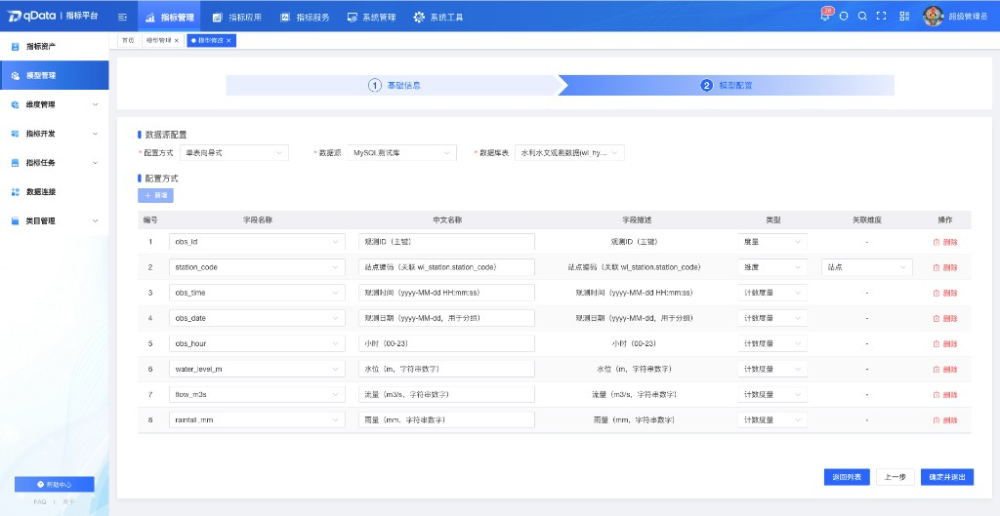
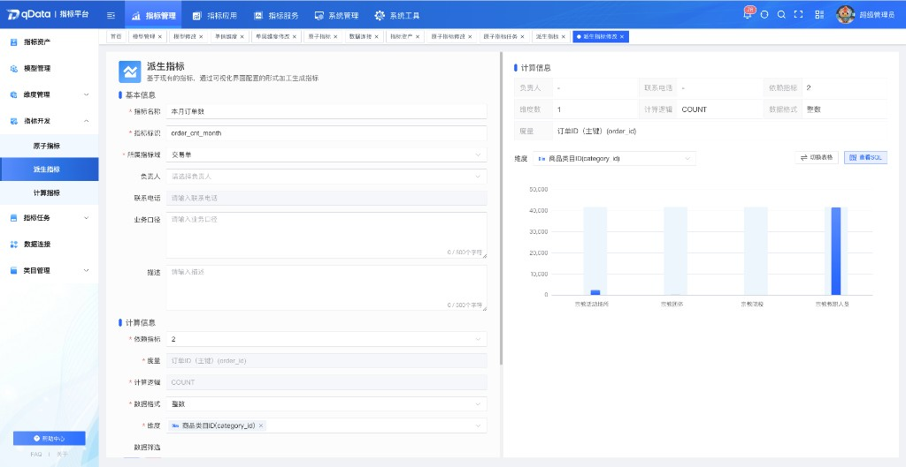
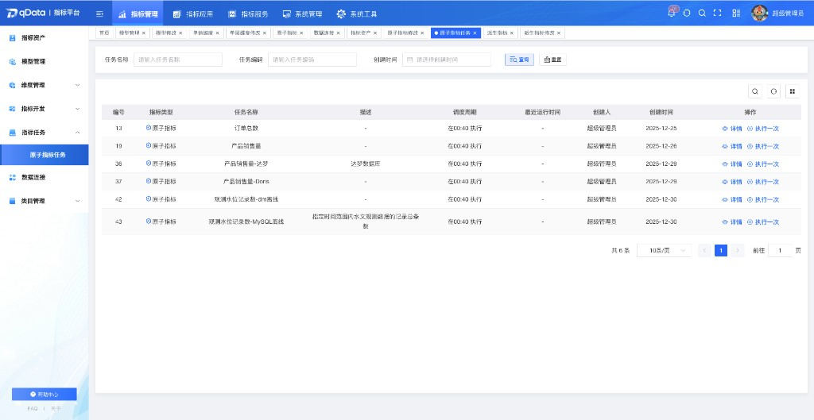
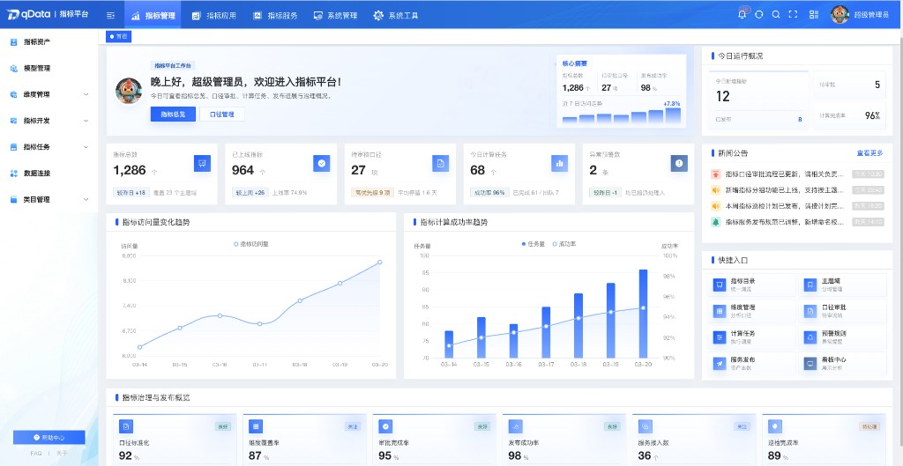
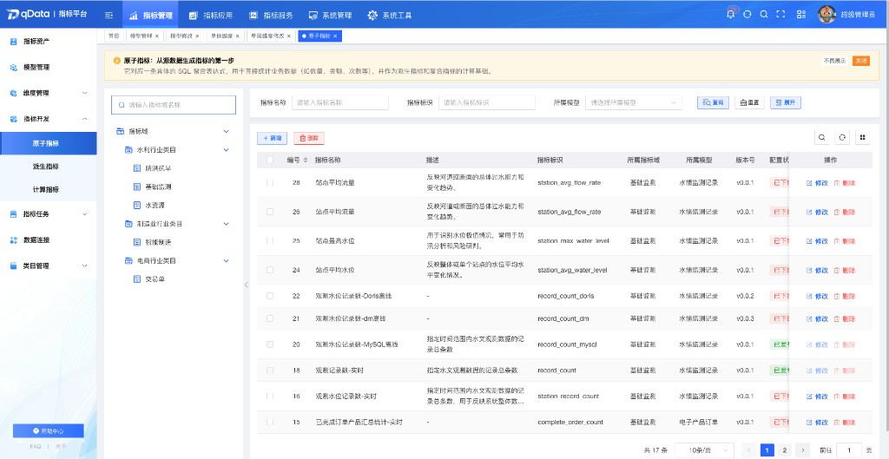
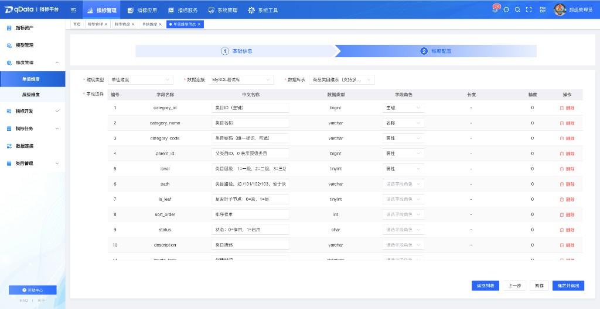

  
  
  
  
  

  
  

  📖简体中文 | <a href="README.en.md">📖English</a>

## 🌈 平台简介
**qData 指标平台**是一套聚焦**指标域与类目管理**、**指标模型与维度建模**、**原子指标与派生指标开发**、**指标任务调度**、**数据连接**与**指标 API 服务化开放**的指标管理平台，致力于帮助企业建立统一的指标资产、计算口径与服务出口。包含系统管理、指标管理、指标服务等能力。

✨✨✨**在线文档**✨✨✨ <a href="https://qdata.qiantong.tech" target="_blank">https://qdata.qiantong.tech</a>

> 如果 qData 指标平台对您有帮助，请点个 **Star ⭐️**，这是我们持续更新的动力！ 🚀

## 🍱 使用场景

适用于需要统一指标口径、规范指标开发流程、将指标以 API 等形式对外提供服务的企业、集团与政企组织。

| 场景          | 描述                            | 典型客户类型             |
| ----------- | ----------------------------- | ------------------ |
| **指标资产与目录管理**  | 需要按指标域、类目组织指标资产，完成检索、上下架、版本记录与试运行验证，形成可管理的指标目录。 | 数据中台团队、分析团队、信息化部门     |
| **模型化指标开发** | 需要以事实表与维度表关系构建指标模型，并在此基础上配置原子指标、派生指标及预计算与调度策略。 | 数据开发、BI 与指标运营团队    |
| **维度标准化**  | 需要通过单值维度等能力统一维度表、主键与属性字段，支撑模型绑定与指标筛选口径一致。   | 数据建模、数据治理团队 |
| **指标任务运维** | 需要查看指标相关任务列表与详情，并按需手动触发执行，掌握最近运行时间与任务描述等信息。 | 运维团队、指标负责人  |
| **指标 API 开放** | 需要将数据封装为可分类管理、可测试、可限流的 API，并配合应用、密钥与调用日志做基础管控。 | 开放平台、集成团队、业务系统建设方  |

## 💡 优势

| 优势点          | 描述                             |
|--------------| ------------------------------ |
| **指标与模型一体化** | 从指标域、模型、维度到原子/派生指标形成连贯链路，便于统一口径与复用。       |
| **基础能力清晰**   | 覆盖系统管理、指标资产、模型、维度、指标类型开发、任务、数据连接与 API 服务等模块，边界清楚。     |
| **开发与校验协同**  | 支持指标试运行、SQL 与结果查看、版本信息等能力，便于配置校验与发布留痕。     |
| **原子与派生分层**  | 原子指标承载基础计算与预计算调度，派生指标在原子能力上完成业务化配置与预览，结构清晰。          |
| **数据连接与建模**  | 提供数据源接入与连接管理，支撑模型构建与指标计算所需的数据底座。         |
| **API 服务发布** | 支持 API 类目、参数与返回配置、测试、限流及调用日志、应用与密钥管理，便于服务化交付。   |

## 📋 功能清单

| 模块 | 描述 |
|------|------|
| 指标资产 | 提供指标 **全生命周期管理** 的基础能力，支持指标查询定位、查看基础信息与计算信息、上架下架及试运行等操作，并通过版本管理对历史版本进行查询与说明维护。检索侧支持按指标域分类检索，按指标名称、指标标识、指标类型组合查询，以及左侧树形目录按行业类目、业务类目逐级筛选。概览中可查看所属模型、事实表、度量字段、计算逻辑、时间维度字段、关联维度、原始数据筛选条件，以及任务信息（如存储位置、最近计算状态与时间、数据粒度、更新策略、异常处理策略等）。支持试运行并查看计算结果，以图表或表格展示，并可查看试运行对应 SQL。版本管理支持按版本号、修改人、状态、修改时间筛选列表，查看版本详情与修改说明，保存指标后生成新版本，并对已发布版本状态进行展示。当前指标类型覆盖 **原子指标** 与 **派生指标**。 |
| 模型管理 | 作为 **指标开发核心底座** 进行统一建模，通过定义多个表之间的连接关系形成完整数据集合，后续指标开发与查询均基于模型开展。支持指标模型列表展示模型基本信息、版本号、状态、关联指标数、负责人、创建人、创建时间等；支持模型上下线、编辑、删除及历史版本查看。创建模型时可填写模型名称、模型标识、负责人等，以 1 个事实表与 N 个维度表组织，并完成事实表与维度表的关联配置。在事实表字段侧支持编辑字段信息，对非数值型及含 “id” 的字段、日期字段、其余数值型字段等给出维度 / 日期维度 / 度量的自动识别，并允许手工调整；维度字段可绑定维度管理中的维度模型，实现维度复用与统一管理。 |
| 单值维度 | 用于对业务对象的单一维度信息进行标准化管理，支持基于数据源选择维度表、配置维度主键及普通字段，并可新增属性字段，供指标筛选与条件限定使用。支持新增单值维度并维护名称、标识、描述等基础信息；在创建过程中选择维度表来源，展示来源表字段并完成维度配置；主键限定为一个；可基于维度字段配置属性字段，并支持删除无效字段，结合字段数据类型、长度、精度等信息完成字段管理。 |
| 原子指标 | 基于模型和源数据生成基础统计指标，支持配置基础信息、度量字段、计算逻辑、维度、时间粒度及筛选条件，并可根据定义生成可执行 SQL，完成计算、结果校验与日志记录；支持预计算与调度配置。列表侧支持展示指标名称、描述、指标标识、所属指标域、所属模型等，并支持条件查询与新增、修改、删除。配置侧支持维护指标名称、标识、所属指标域、负责人、业务口径、描述等，选择所属模型，配置度量字段、计算逻辑、数据格式、关联维度等，可查看 SQL 与表格视图下的计算结果。计算处理侧支持按模型关联关系拼接事实表与维度表、生成 Join 与 Where、对原始数据与计算结果进行筛选与排序等处理，校验结果字段类型与格式，并记录 SQL、耗时、数据量、错误信息等日志。支持配置原始数据筛选条件（多条件组合与逻辑关系）、时间粒度及时间范围相关逻辑。预计算支持配置数据连接与分层、单次或计划调度及调度周期等。 |
| 派生指标 | 在原子指标基础上进行加工与业务化配置，支持录入基础信息、选择依赖原子指标、配置数据格式与分析维度及对原始数据筛选；支持数据预览、图表查看、SQL 查看与日志查看。列表展示指标名称、指标标识、所属指标域、依赖指标等，并支持新增、修改、删除。创建时可维护指标目录、名称、英文名称、负责人、业务口径、描述及所属指标域。计算信息配置可选择依赖的原子指标，继承其度量字段与计算逻辑，在原子指标维度范围内选择分析维度，配置数据格式及对原始数据的业务限定；预览时可按维度筛选，切换图表类型，查看 SQL 与运行日志，用于校验配置是否正确。 |
| 指标任务 | 统一管理原子指标、派生指标等任务类型，支持任务列表展示任务编号、指标类型、任务名称、描述、调度周期、最近运行时间、创建人、创建时间等信息，支持按任务名称、任务编码、创建时间等条件查询，查看任务详情并手动执行一次任务。 |
| 数据连接 | 提供关系型数据库数据源的接入与统一管理能力，支撑指标建模与指标计算的基础流程。 |
| 指标域管理 | 指标域与维度类目共同承担指标平台基础分类体系建设，为模型建设、维度管理、指标开发与检索提供分类基础。指标域支持按名称、上级类目、创建时间等查询，列表展示名称、描述、状态、排序、备注、创建人、创建时间等，树形展示上下级关系，并支持新增、编辑、删除、启用、停用。维度类目同样支持按名称、上级类目、创建时间查询，列表与树形层级展示，以及新增、编辑、删除、启用、停用。 |
| 指标 API | 支持将底层数据资源封装为 **标准化 API**，并对分类、属性、参数、版本、数据源、测试与限流规则进行统一配置和管理。支持单表向导式、SQL 脚本式等方式配置 API 数据源；按数据服务类目分类管理，左侧类目树查看对应 API 清单；列表展示 API 名称、描述、服务类目、版本、路径、请求类型、返回格式、状态、创建人等，并支持条件查询与新增、修改、删除、详情。可通过向导分步完成属性配置、参数配置与接口测试；维护类目、名称、路径、版本、请求方式、返回格式、描述、备注及请求参数、返回字段；支持接口测试与限流规则配置。 |
| 调用日志 | 支持对 API 调用过程进行统一记录与查询，可按 API 服务类目查看日志，按 API 服务名称、状态、调用时间等条件筛选；列表展示 API 服务名称、调用者 IP、调用接口地址、调用数据量、调用耗时、状态、调用时间等，支持查看单次调用详情（调用参数、请求方式、异常信息等），并支持对调用日志进行删除等管理操作。 |
| 应用管理 | 支持对调用 API 的应用进行统一管理，可新增、修改、删除与详情查看；维护应用名称、应用类型、应用图标、是否公开、描述与备注等基础信息，按应用名称、类型、是否公开等条件查询，在列表与详情中查看密钥等内容，并支持重置应用密钥以保障访问安全。 |
| 指标 API 类目 | 支持对平台内 API 服务进行标准化分类与层级化管理，以树状结构组织服务资源。展示类目名称、描述、包含 API 数量、创建时间等，支持多层级类目体系、按类目名称与描述等检索筛选，以及类目的新增、编辑、删除与排序；可将已开发的 API 关联到具体类目，并查看类目关联 API 数量与状态概览。 |

👉 qData 指标平台围绕指标建模、开发与服务场景提供能力，功能将持续迭代完善。

💡 如您有好的建议或功能需求，欢迎 [提交Issue](https://gitee.com/qiantongtech/qData/issues)，与我们共同完善指标平台功能。

[//]: # (## 🧩 架构图)

[//]: # (![framework.png]&#40;images%2Fframework.png&#41;)

## 🛠️ 技术栈
qData 指标平台采用前后端分离架构，后端基于 Spring Boot，前端基于 Vue 3，并整合了主流的认证、数据库访问、缓存、Apache Flink 指标计算与前端组件能力。

<table>
  <tr>
    <th>分类</th><th>技术</th><th>描述</th>
  </tr>
  <tr>
    <td rowspan="7">后端技术栈</td><td>Spring Boot</td><td>提供快速开发能力与统一服务启动入口</td>
  </tr>
  <tr>
    <td>Spring Security</td><td>实现用户认证、授权与安全控制</td>
  </tr>
  <tr>
    <td>MySQL、达梦8</td><td>持久化存储与数据源配置管理</td>
  </tr>
  <tr>
    <td>MyBatis-Plus</td><td>简化数据库操作与多数据源访问</td>
  </tr>
  <tr>
    <td>Redis</td><td>支持缓存、登录态与基础中间件能力</td>
  </tr>
  <tr>
    <td>Apache Flink</td><td>支撑指标预计算、调度任务等分布式计算与执行能力</td>
  </tr>
  <tr>
    <td>Knife4j / OpenAPI</td><td>提供接口文档展示与联调支持</td>
  </tr>

  <tr>
    <td rowspan="3">前端技术栈</td><td>Vue 3</td><td>现代化响应式前端框架</td>
  </tr>
  <tr>
    <td>Element Plus</td><td>常用 UI 组件支持与后台管理界面构建</td>
  </tr>
  <tr>
    <td>Vite</td><td>快速开发与构建工具</td>
  </tr>

  <tr>
    <td rowspan="4">第三方插件</td><td>AntV X6</td><td>支撑流程、图形化设计与可视化交互场景</td>
  </tr>
  <tr>
    <td>ECharts</td><td>支撑统计图表与可视化展示能力</td>
  </tr>
</table>

## 🏗️ 部署要求

在部署 qData 指标平台之前，请确保以下环境和工具已正确安装；指标预计算与调度依赖 Apache Flink 运行环境，请与数据库、Redis 等一并规划。

<table>
  <tr>
    <th>环境</th><th>项目</th><th>推荐版本</th><th>说明</th>
  </tr>
  <tr>
    <td rowspan="6">后端</td><td>JDK</td><td>1.8 或以上</td><td>建议使用 OpenJDK 8；若 Flink 发行版要求更高 JDK，请以 Flink 官方说明为准</td>
  </tr>
  <tr>
    <td>Maven</td><td>3.6+</td><td>项目构建与依赖管理</td>
  </tr>
  <tr>
    <td>达梦8 / MySQL</td><td>8.0+</td><td>关系型数据库环境，开发配置默认偏向达梦8</td>
  </tr>
  <tr>
    <td>Redis</td><td>5.0+</td><td>缓存与登录态等基础能力支持</td>
  </tr>
  <tr>
    <td>Apache Flink</td><td>与项目依赖一致</td><td>指标预计算与调度任务的分布式计算引擎</td>
  </tr>
  <tr>
    <td>Docker / Docker Compose</td><td>可选</td><td>用于快速体验和测试环境部署；若编排中包含 Flink，请一并拉起相关服务</td>
  </tr>

  <tr>
    <td rowspan="3">前端</td><td>Node.js</td><td>16+</td><td>前端构建工具依赖</td>
  </tr>
  <tr>
    <td>npm</td><td>8+</td><td>包管理器</td>
  </tr>
</table>

[//]: # (## 🚀 快速开始)

[//]: # ()
[//]: # (| 部署方式                    | 说明                                                              | 适用场景               |)

[//]: # (| ----------------------- | --------------------------------------------------------------- | ------------------ |)

[//]: # (| Docker Compose 体验部署 | 通过 `docker/` 目录中的编排文件快速启动数据库、Redis、Flink、Nginx 与后端服务等（以实际编排为准），适合先体验指标平台功能。 | **初学者快速上手**、功能演示、测试环境  |)

[//]: # (| 使用源代码本地启动  | 后端与前端按项目模块与目录说明执行构建与启动命令。  | **日常开发**、功能联调          |)

[//]: # (| 自主部署（纯手工安装）  | 根据环境配置文件、数据库初始化脚本和前端构建产物，手工完成部署与参数配置。 | **生产环境**、大规模部署、个性化定制场景 |)

[//]: # ()
[//]: # (👉 查看完整的安装与部署资料时，建议结合 `docker/`、服务端配置目录、`sql/` 目录与官方文档一并使用。)

## 👥 QQ交流群
欢迎加入 qData 官方 QQ 交流群，获取最新动态、技术支持与使用交流。

👉 <a href="https://qdata.qiantong.tech/discuss.html">点击加入 QQ 交流群</a>

<!-- 

 -->

## 🖼️ 系统配图
<table>
  <tr>
    <td width="50%" valign="top"></td>
    <td width="50%" valign="top"></td>
  </tr>
  <tr>
    <td width="50%" valign="top"></td>
    <td width="50%" valign="top"></td>
  </tr>
  <tr>
    <td width="50%" valign="top"></td>
    <td width="50%" valign="top"></td>
  </tr>
</table>
